# Hangman Game

The game is based on the typical Hangman word guess principle. It´s a terminal game hosted Heroku ([url to prod site](https://portfolio3-hangman-3c9d3306a756.herokuapp.com/)) and written in Python. For each wrong guess the gallow is build up and stickman is going to be hung up. You have 7 attempts to guess to correct word. 
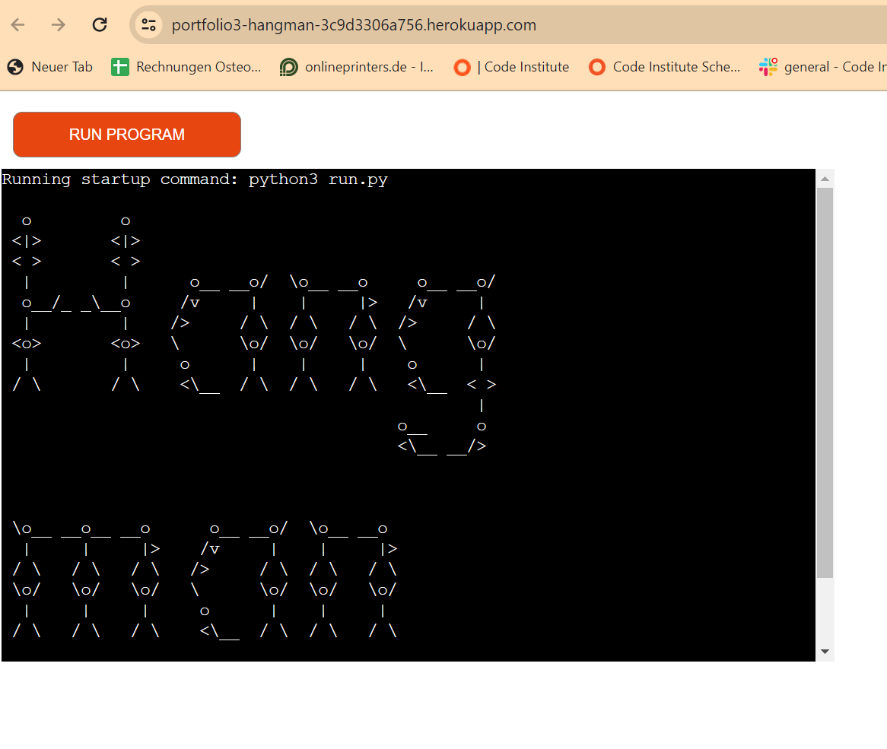

## User Experience
Aim of this project is to provide an easy to handle and easy to use guess game for the interested user.

### User Stories
 - As a user I want to easily understand the idea and instructions of the game
 - As a user I want to have the possibility to skip the instructions because everyone knows the rules for Hangman 
 - As a user I want to have a seamless game flow and direct feedback from the software in case of incorrect inputs (validation of input)
 - As a user I want to directly understand if my guess was correct or wrong
 - As a user I want to see the progress of the game 
 - As a user I want to know which letters I have already used
 - As a user I want to have the possibility to restart the game or play it again

## Process diagram / Flowchart
The flowchart diagram was build with [Draw IO](https://app.diagrams.net/)
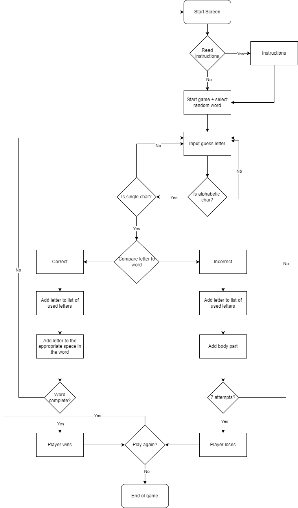

## Wordart/Fonts
I used the font "acrobatic" font from figlet (http://www.figlet.org/fontdb_example.cgi?font=acrobatic.flf). It based on stickman figures, so it matches very well to the idea of the game.

## Features
### Existing features

#### Start Game
The starting screen, should give a non verbal direct Idea about what the game is about. It shows the titel of the game "Hangman" in stickman fonts. So every user who knows Hangman directly understand that this is a hangman guessing game. If as user don´t knows Hangman he has the option to read the instruction.

#### Instruction
The user has the possibility to get a brief overview about how to play the game. The instruction is as short as possible, as it is a simple game. The user has the possibility to skip the instructions as most of the people know Hangman. 

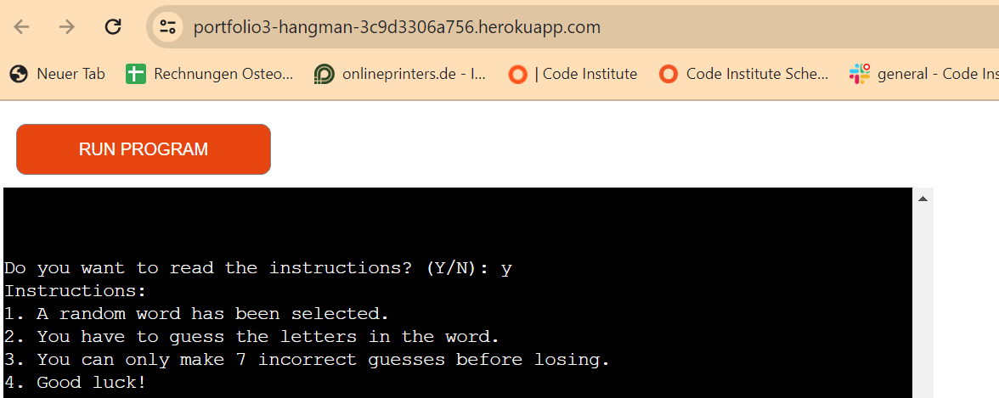

#### Gameplay 
- A random word will be selected, which the user has to guess
- For each turn the user can guess one letter
- A gallow is shown and a stickman and the word "Hangman" is constructed for each wrong guess
- The user can do 7 wrong attempts before he lose and the "Hangman" is hung up
- Used letters are displayed to the user
- For each letter in the word a "_" is displayed, so that the user knows how many letters he has to guess
- Each correct guessed letter is displayed in the word to guess
- validation controls check if the letter is a letter and no other character (e.g. Num) and if only one letter is entered
- The game ends either by guessing the correct word or by running out of attempts

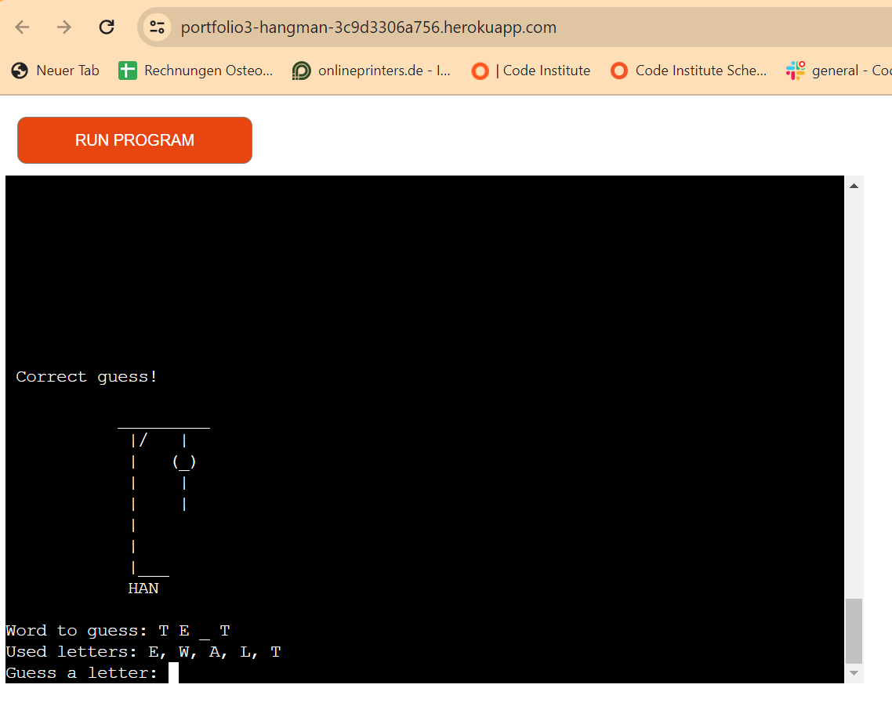

#### End of game
- At the end of game it is displayed to the user with the wordart "Acrobatic" if he has won or lost
- He has the possibility to directly restart the game or skip it 
- If he skip it he will see a "Goodbye" screen

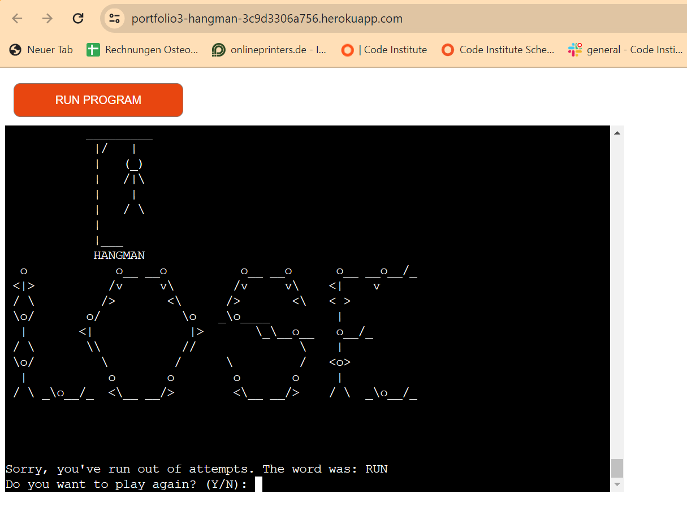 
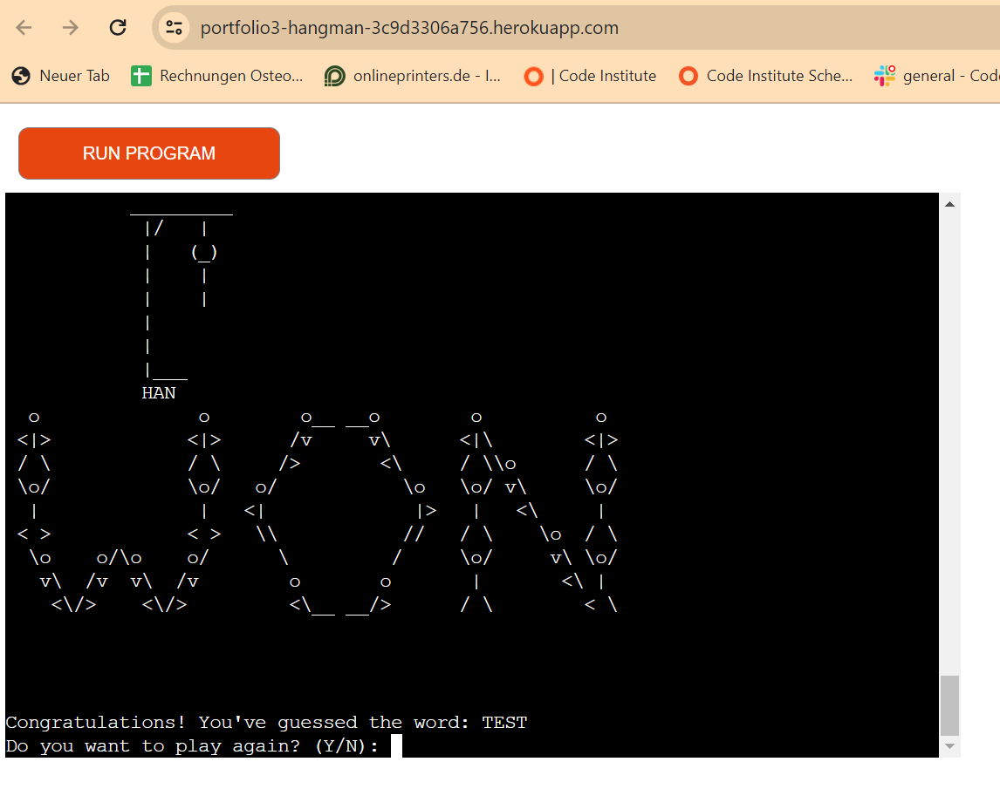 
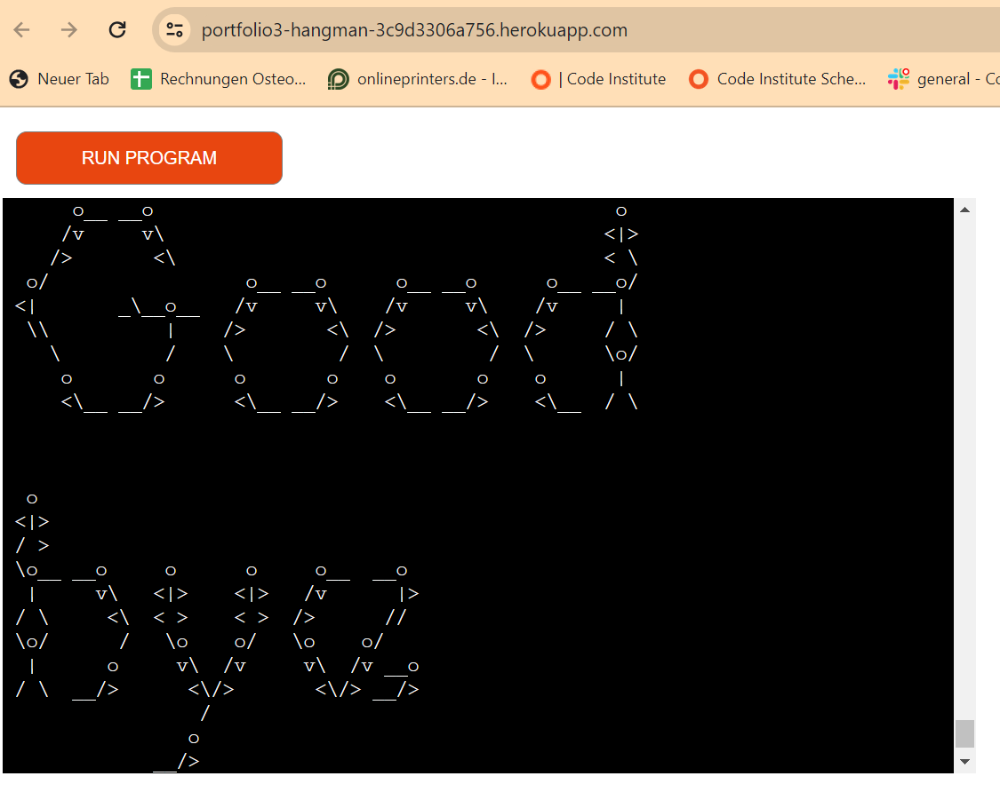 

### Future Features
 - Possibility to enter a user name
 - Create a High Score list based on the user name 
 - Possibiliy to guess the full word in one guess

## Testing
### Manual testing
The following Test Cases were used for manual testing:
 - Test "Rungame" button in terminal if it restarts the game
 - Check if "Y/N" will show or skip the display of instructions
 - After starting the game 
    - is the gallow correctly displayed?
    - do I see the number of characters represented by number of "_" in the word to guess
 - After each correct guess:
    - do I get feedback of the guess was correct 
    - will the used letter added to list of used letters
    - will a correct guessed letter be added to the word to guess
 - After each incorrect guess:
    - do I get feedback of the guess was correct 
    - will the used letter added to list of used letters
    - will the stickman move to the next stage of construction
    - will the word "Hangman" will be extended by another letter
 - Validation controls:
    - is it prevented to enter other characters then letters?
    - is it prevented to enter more then one letter?
    - is it prevented to enter the same letter again?
    - do I get proper notifications for above validation controls?
 - At the end of game:
    - Do I get proper feedback if I have won or lost?
    - Can I restart or abort the game?

Above manual test cases were executed multiple times after each change and after generating the final version of the code.

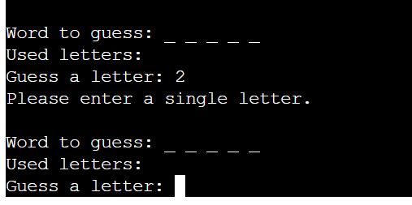
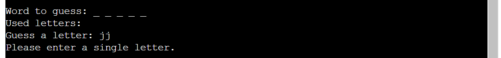
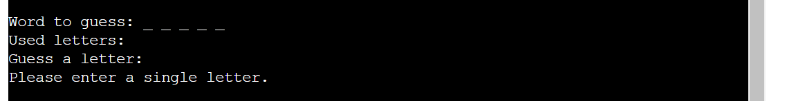

### Automated testing
Code Institutes  validator https://pep8ci.herokuapp.com/ to check the code automatically.
As a result of this testing no errors were visible:

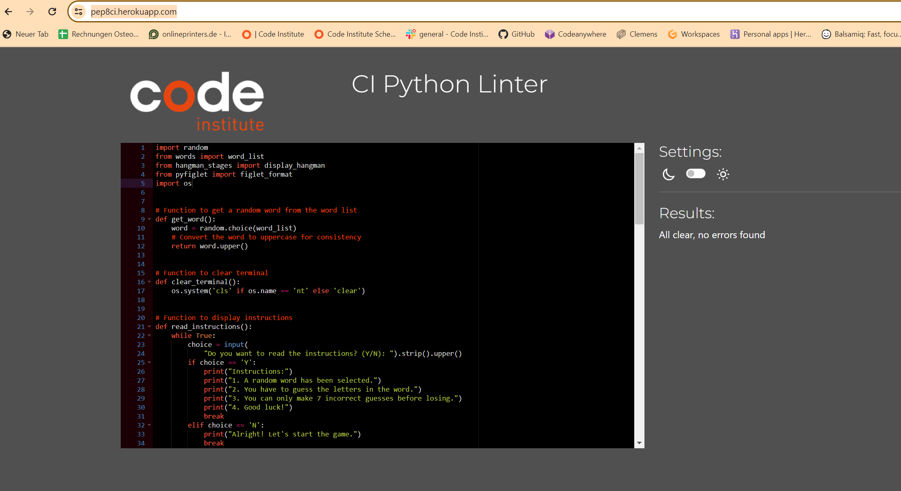

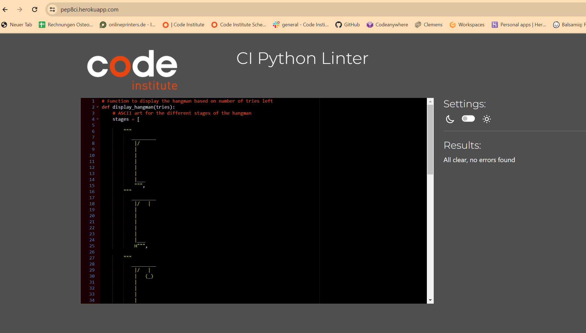

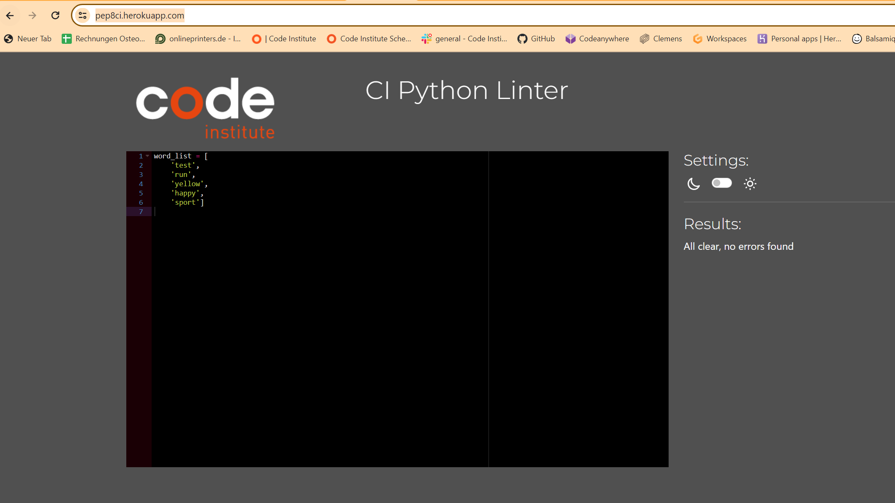

## Technologies used

### Languages: 
 - Python
### Libraries:
 - "random" to randomize the guess word
 - "os" for the clear function to clear the terminal
 - "pyfiglet" to import Acrobatic wordart 

### Others:
 - Github as repository
 - Heroku as deployment platform to host the live version 
 - [Draw IO](https://app.diagrams.net/) for creating the flowchart
  
## Bugs
No known bugs

## Deployment
The app was deployed with Heroku by the following steps:

1. Create new app in Heroku
2. Add unique name for the app and select Europe as region and click "Create app".
3. In "Settings-Tab" add buildpacks for `Python` and `NodeJS`(Config_vars are not required for the game.).
4. In "Deploy-Tab" select GitHub as deployment method and connect the Github repository with Heroku
5. For the initial deployment use manual deployment; afterwards  enable automatic deployment. So that deployment happens automatically with the execution of every "git push" command.  

## Credits
### Code
 - Hangman stages as ASCII wordart: https://codereview.stackexchange.com/questions/101968/hangman-with-ascii
 - Wordart fonts "Acrobatic": http://www.figlet.org/fontdb_example.cgi?font=acrobatic.flf
 - Considerations for the basic architecture of the game: https://www.youtube.com/watch?v=m4nEnsavl6w

### Acknowledgements
Thanks to my mentor Antonio and Kristyna for the consideration about the PP3. 